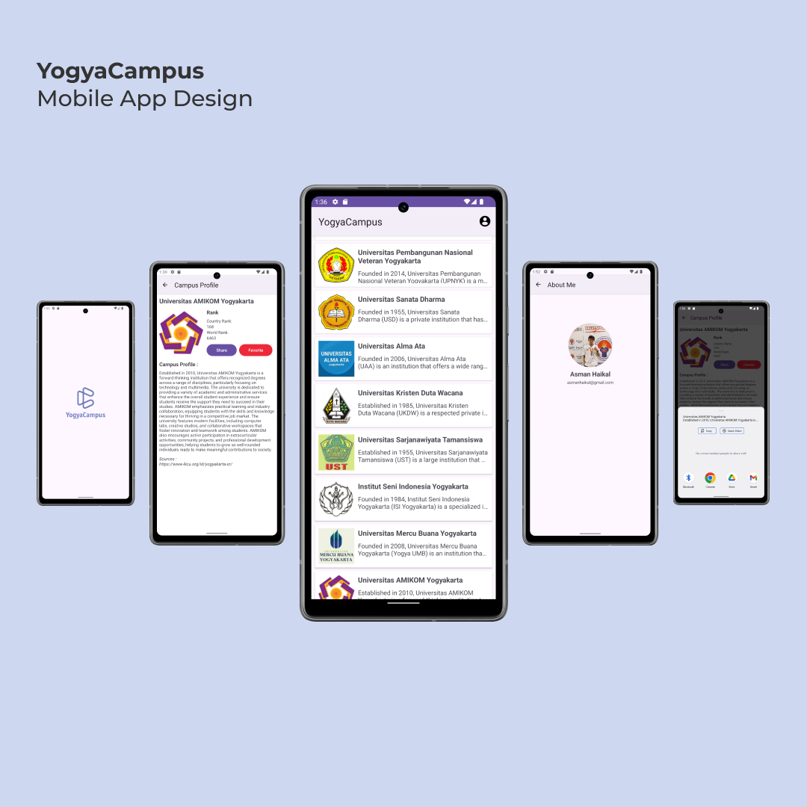

# Dicoding-AndroidPemula
Repository for Documentations [Dicoding - Belajar Membuat Aplikasi Android untuk Pemula](https://www.dicoding.com/academies/51/)

## Purpose
Record Project Belajar Membuat Aplikasi Android untuk Pemula from [Dicoding Indonesia](https://www.dicoding.com/)

## Screenshots Final Submission

## Features

Final Submission Checklists
- [x] Display page about
- [x] Display splash screen
- [x] Display button back at Action Bar
- [x] A detail page appears when an item is clicked
- [x] Display images and information in the format list
- [x] Display images and information on the detail page
- [x] Include button favorite and share with implicit intent

## Installation
Download and install beta version here (available soon)

## Author
- **Asman Haikal**
